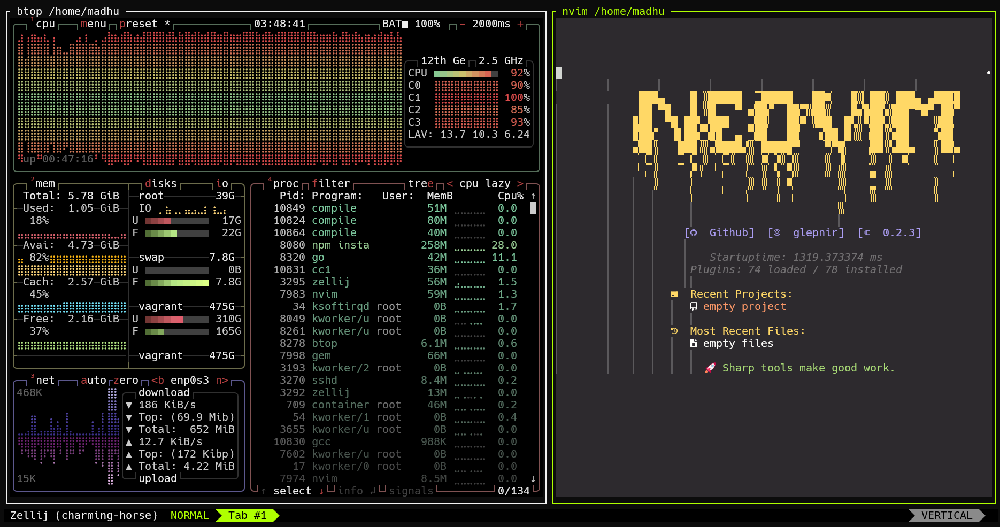

# Workstation setup

Setting this up for replicable workstation anywhere. Takes about an hour to build.

This requires the following plugins: `vagrant-timezone` and `vagrant-disksize`.

```sh 
# needed for docker tz and other tz data to avoid defaulting to utc
vagrant plugin install vagrant-timezone
# needed for resizing disk
vagrant plugin install vagrant-disksize
# needed for loading dependencies
vagrant plugin install vagrant-env
```

## Quickstart

See `Makefile` for details.



## Manual commands (bypassing Makefile)

Basic usage:

```sh
# spin it up
vagrant up

# reload it to mount relative dirs
vagrant reload

# use the box (with display for clipboard support)
vagrant ssh -- -X

# rebuild if needed 
vagrant reload --provision

# put it to sleep when done
vagrant suspend

# package it to avoid rebuilding
vagrant package workstation --output workstation.box
```

## Common Issues

Daily reboots are required for some reason or system clock will drift (ex: putting host to sleep and waking it up 3 days later).

SSH with `-- -X` and you will have access to clipboard for common copy pasting activities (ex: nvim).

If stuck with `Stderr: VBoxManage.exe: error: The object functionality is limited` nuke the `~/.VirtualBox` directories.

If stuck with `workstation: Warning: Authentication failure. Retrying...`, find the `insecure_private_key`, typically
in the home dir's `.vagrant` path and destroy that file. Then `vagrant halt`, `vagrant destroy`, and `vagrant up`.
